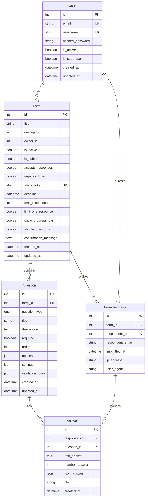

# SaaS Survey Database Schema Diagram

## ERD (Entity Relationship Diagram)



## 테이블 관계 설명

### 1. **User (사용자)**
- 시스템의 사용자 정보를 저장
- Form의 소유자 역할
- FormResponse의 응답자 역할 (로그인한 경우)

### 2. **Form (설문 폼)**
- 설문조사 폼의 메타데이터
- User와 1:N 관계 (한 사용자가 여러 폼 생성 가능)
- 공유 링크(`share_token`), 마감일, 최대 응답 수 등 설정 포함

### 3. **Question (질문)**
- 각 폼에 속한 개별 질문들
- Form과 1:N 관계 (한 폼에 여러 질문)
- 11가지 질문 유형 지원 (QuestionType enum)
- JSON 필드로 유연한 옵션 및 설정 저장

### 4. **FormResponse (응답)**
- 사용자가 제출한 전체 응답
- Form과 1:N 관계 (한 폼에 여러 응답)
- 응답자 정보 및 메타데이터 저장

### 5. **Answer (개별 답변)**
- 각 질문에 대한 구체적인 답변
- FormResponse와 1:N 관계 (한 응답에 여러 답변)
- Question과 1:N 관계 (한 질문에 여러 답변 가능)
- 다양한 답변 형태 지원 (텍스트, 숫자, JSON, 파일)

## RESTful API 설계를 위한 리소스 구조

```
/api/users                    # 사용자 관리
/api/forms                    # 폼 목록 및 생성
/api/forms/{id}              # 특정 폼 조회/수정/삭제
/api/forms/{id}/questions    # 폼의 질문 관리
/api/forms/{id}/responses    # 폼의 응답 조회
/api/forms/{id}/submit       # 폼 응답 제출
/api/responses/{id}          # 특정 응답 상세 조회
/api/responses/{id}/answers  # 응답의 개별 답변들
```

## 주요 특징

1. **유연한 질문 타입**: 11가지 다양한 질문 유형 지원
2. **JSON 필드 활용**: options, settings, validation_rules로 유연한 설정
3. **공유 기능**: share_token으로 폼 공유 링크 생성
4. **응답 제한**: 마감일, 최대 응답 수, 1인 1응답 제한 등
5. **익명 응답 지원**: respondent_id가 nullable로 비로그인 응답 가능

## 개선 고려사항

1. **소프트 삭제**: deleted_at 필드 추가로 논리적 삭제 구현
2. **버전 관리**: 폼 수정 이력 추적을 위한 versioning
3. **템플릿**: 자주 사용하는 폼을 템플릿으로 저장
4. **카테고리/태그**: 폼 분류를 위한 category/tag 시스템
5. **팀/조직**: 다중 사용자 협업을 위한 team/organization 모델