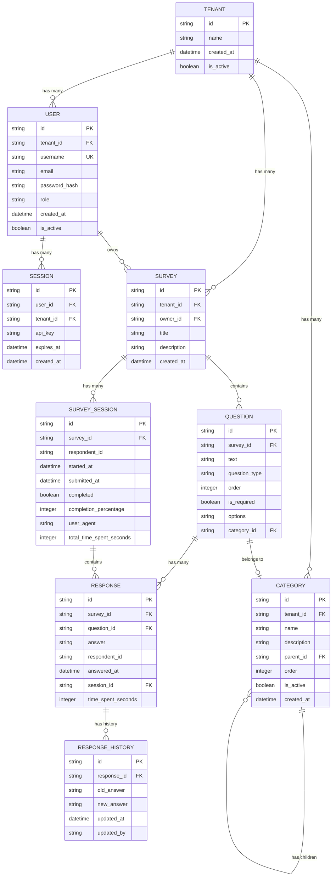

# SaaS Survey System ERD

## Entity Relationship Diagram

## 엔티티 관계 설명

### 1. 핵심 관계

#### Tenant (테넌트) - 최상위 엔티티
- **User** (1:N): 한 테넌트는 여러 사용자를 가질 수 있음
- **Survey** (1:N): 한 테넌트는 여러 설문을 생성할 수 있음
- **Category** (1:N): 한 테넌트는 여러 범주를 가질 수 있음

#### User (사용자)
- **Tenant** (N:1): 각 사용자는 하나의 테넌트에 속함
- **Session** (1:N): 한 사용자는 여러 세션을 가질 수 있음
- **Survey** (1:N): 한 사용자는 여러 설문을 소유할 수 있음 (owner_id)

#### Survey (설문)
- **Tenant** (N:1): 각 설문은 하나의 테넌트에 속함
- **User** (N:1): 각 설문은 한 명의 소유자를 가짐
- **Question** (1:N): 한 설문은 여러 질문을 포함
- **Survey_Session** (1:N): 한 설문은 여러 응답 세션을 가질 수 있음

#### Question (질문)
- **Survey** (N:1): 각 질문은 하나의 설문에 속함
- **Category** (N:0..1): 각 질문은 선택적으로 하나의 범주에 속할 수 있음
- **Response** (1:N): 한 질문은 여러 응답을 받을 수 있음

#### Category (범주)
- **Tenant** (N:1): 각 범주는 하나의 테넌트에 속함
- **Category** (자기참조, N:0..1): 계층 구조를 위한 부모 범주
- **Question** (1:N): 한 범주는 여러 질문을 포함할 수 있음

#### Survey_Session (설문 응답 세션)
- **Survey** (N:1): 각 세션은 하나의 설문에 대한 응답
- **Response** (1:N): 한 세션은 여러 응답을 포함

#### Response (응답)
- **Survey** (N:1): 각 응답은 하나의 설문에 속함
- **Question** (N:1): 각 응답은 하나의 질문에 대한 답변
- **Survey_Session** (N:1): 각 응답은 하나의 세션에 속함
- **Response_History** (1:N): 한 응답은 여러 수정 이력을 가질 수 있음

#### Response_History (응답 수정 이력)
- **Response** (N:1): 각 이력은 하나의 응답에 대한 수정 기록

### 2. 주요 비즈니스 규칙

1. **다중 테넌트 격리**: 모든 데이터는 tenant_id로 완전히 격리됨
2. **권한 기반 접근**: User의 role (TENANT_ADMIN, SURVEY_MANAGER, RESPONDENT)에 따라 접근 권한 제어
3. **설문 소유권**: 각 설문은 owner_id를 통해 특정 사용자가 소유
4. **계층적 범주**: Category는 parent_id를 통해 무한 계층 구조 지원
5. **응답 추적**: 모든 응답은 Survey_Session을 통해 추적되며, 응답 시간 및 수정 이력 관리
6. **질문 순서**: Question의 order 필드로 설문 내 질문 순서 관리
7. **선택적 범주**: 질문은 선택적으로 범주에 속할 수 있음 (category_id는 nullable)

### 3. 데이터 무결성 제약

- **Unique 제약**:
  - User.username: 테넌트 내에서 고유
  - Session.api_key: 시스템 전체에서 고유

- **Foreign Key 제약**:
  - 모든 엔티티는 tenant_id로 테넌트와 연결
  - Question은 survey_id로 설문과 연결
  - Response는 question_id, session_id로 연결

- **Cascade 규칙**:
  - Tenant 삭제 시: 관련된 모든 데이터 삭제 (CASCADE)
  - Survey 삭제 시: 관련 Question, Response, Survey_Session 삭제
  - User 삭제 시: Session은 삭제되지만 Survey는 유지 (소유권 이전 필요)

### 4. 인덱스 전략 (권장)

성능 최적화를 위한 인덱스:
- tenant_id: 모든 테이블에서 인덱스 생성
- survey_id: Question, Response, Survey_Session 테이블
- user_id: Session, Survey (owner_id) 테이블
- session_id: Response 테이블
- respondent_id: Response, Survey_Session 테이블
- parent_id: Category 테이블 (계층 구조 탐색용)